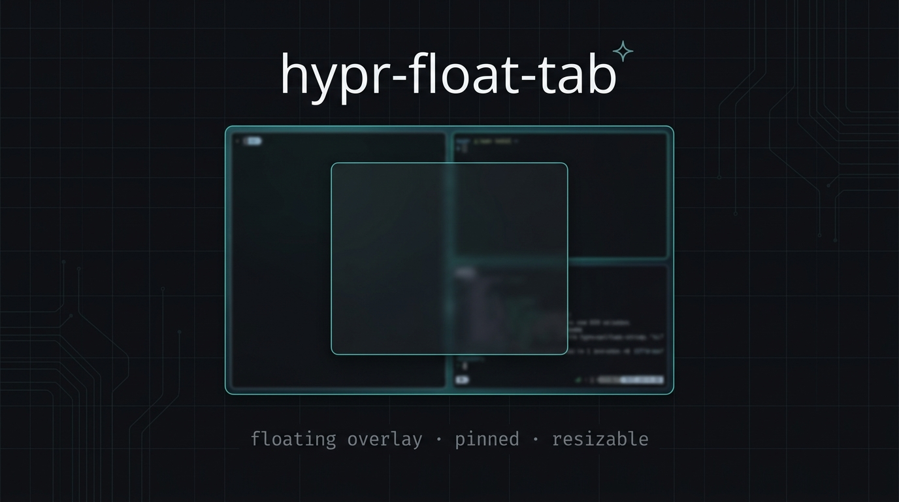

<div align="center">
  
</div>

<br/>

<div align="center">

**Pin any window as a floating overlay — across every workspace.**  
One keybind. Zero friction.

[](https://hyprland.org)
[](float-tab-toggle.sh)
[](LICENSE)

</div>

---

## What it does

`hypr-float-tab` turns any focused window into a **pinned floating overlay** — think *picture-in-picture, for any app*:

- Sizes to **50 × 65 %** of your monitor, centered on activation
- **Pinned** — stays visible over every workspace
- **Freely movable** with `Super + Left Click`
- **Resizable** by dragging any border edge (no modifier key needed)
- Press the keybind again → snaps back to your tiling layout

> [!NOTE]
> Supports both **Hyprland Lua config** (≥ 0.45) and the **legacy `.conf`** format.
> The installer auto-detects which one you use.

---

## Quick install

Don't want to touch any config files yourself? One command handles everything:

```bash
git clone https://github.com/AEON-mod/Scripts.git
cd hypr-float-tab
./install.sh
```

The installer will:
- Copy `float-tab-toggle.sh` into `~/.config/hypr/scripts/`
- Wire the keybind (`Super + Shift + F` by default)
- Enable smooth border-drag resize in your Hyprland config
- Enable smooth resize animation so content never lags
- Reload Hyprland — changes take effect instantly

> [!TIP]
> Want a different keybind or window size? Open `install.sh` and edit the
> **CONFIG** block at the top — it's clearly labelled.

---

## Manual install

Prefer to do it yourself? Four steps:

### 1 — Copy the script

```bash
cp float-tab-toggle.sh ~/.config/hypr/scripts/
chmod +x ~/.config/hypr/scripts/float-tab-toggle.sh
```

### 2 — Bind the keybind

**Lua config** (`keybinds.lua`)
```lua
hl.bind("SUPER + SHIFT + F", hl.dsp.exec_cmd("~/.config/hypr/scripts/float-tab-toggle.sh"))
```

**Legacy config** (`keybinds.conf`)
```ini
bind = Super+Shift, F, exec, ~/.config/hypr/scripts/float-tab-toggle.sh
```

### 3 — Enable smooth border resize

**Lua** (`general.lua`)
```lua
general = {
    resize_on_border        = true,   -- drag any border edge to resize
    extend_border_grab_area = 10,     -- wider invisible grab zone
}
```

**Legacy** (`general.conf`)
```ini
general {
    resize_on_border        = true
    extend_border_grab_area = 10
}
```

### 4 — Eliminate content-refresh lag during resize

**Lua** (`misc.lua`)
```lua
misc = {
    animate_manual_resizes = true,
}
```

**Legacy** (`misc.conf`)
```ini
misc {
    animate_manual_resizes = true
}
```

Then reload: `hyprctl reload`

---

## Controls

| Action | Input |
|---|---|
| Toggle float-tab on / off | `Super + Shift + F` |
| Move the window | `Super + Left Click` drag |
| Resize the window | Left Click & drag any **border edge** |
| Resize (alternative) | `Super + Right Click` drag |

---

## Customising

**Change the default size** — edit the `CONFIG` section in `install.sh`, or edit these two lines directly in `float-tab-toggle.sh`:

```bash
WIN_W=$(( MON_W * 50 / 100 ))   # ← width  as % of monitor
WIN_H=$(( MON_H * 65 / 100 ))   # ← height as % of monitor
```

The script auto-detects your monitor's logical resolution and HiDPI scale, so the size is always pixel-perfect on any display.

---

## Requirements

| Dependency | Purpose |
|---|---|
| `hyprland ≥ 0.45` | Compositor (Lua config support) |
| `hyprctl` | Ships with Hyprland |
| `python3` | JSON parsing in the toggle script |

---

## License

MIT — do whatever you want with it.
